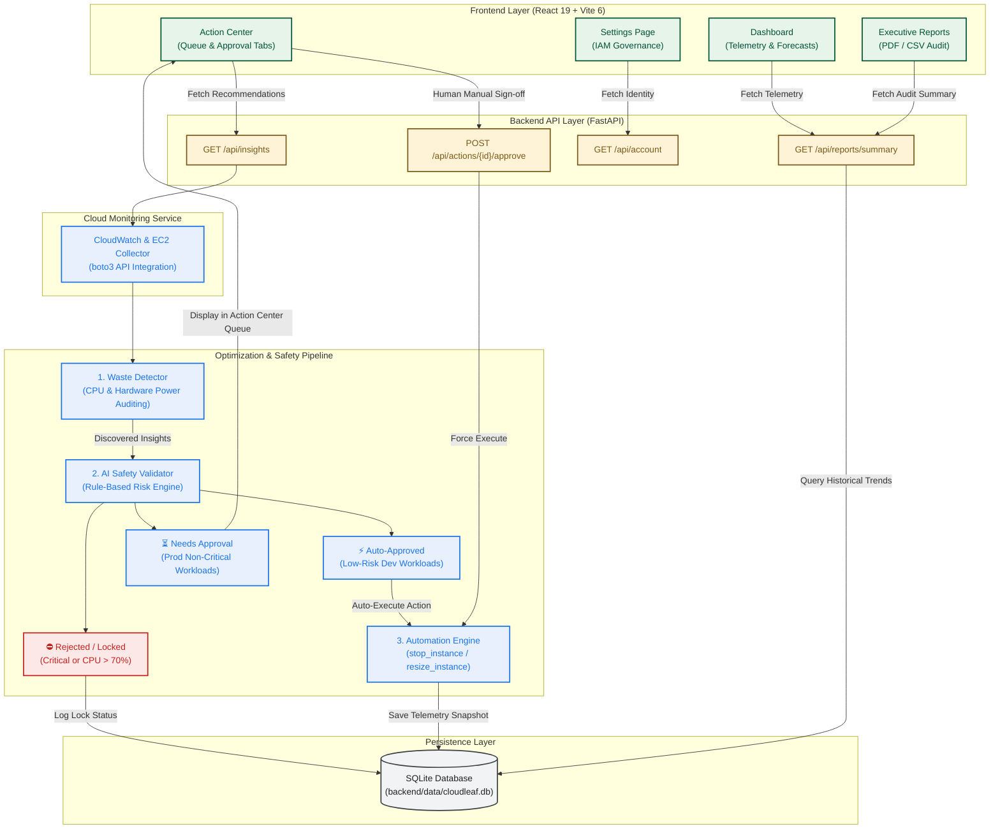

# CloudLeaf AI — System Architecture

This document provides a high-level architecture overview of **CloudLeaf AI**, illustrating the data pipeline, AI validation rules, Action Center human-in-the-loop governance, and persistence layer.

---

## High-Level Data Flow & Architecture

---

## Architectural Highlights

### 1. Data Telemetry & Waste Detection
- **CloudWatch & EC2 Collector**: Reads real-time compute metrics and tags via AWS SDK (`boto3`).
- **Waste Detector**: Classifies workloads as **Idle** (`CPU < 15%`), **Over-provisioned** (`15% <= CPU < 40%`), or **Healthy**. Calculates regional carbon avoidance using Scope 2 GHG grid intensity factors (`kg CO2 / kWh`).

### 2. Multi-Stage AI Safety Validator
Rules are evaluated in strict priority order before any automated action is permitted:
1. **Rule 1 (Block Critical)**: `critical: true` workloads are immediately **Rejected / Locked**.
2. **Rule 2 (Require Sign-off)**: `env: "prod"` workloads require human queue sign-off (**Needs Approval**).
3. **Rule 3 (High CPU Safety)**: Workloads with `CPU > 70%` are **Rejected**.
4. **Rule 4 (Auto-Approve)**: Non-prod, non-critical, safe workloads are **Auto-Approved**.

### 3. Human-in-the-Loop Governance Flow
Production workloads queued under **Awaiting Approval** can be reviewed and manually executed through the Action Center (`POST /api/actions/{id}/approve`), triggering the Automation Engine on-demand.

### 4. Storage & Persistence
All executed actions, telemetry snapshots, and historical monthly trends persist in an embedded **SQLite database** (`backend/data/cloudleaf.db`).
